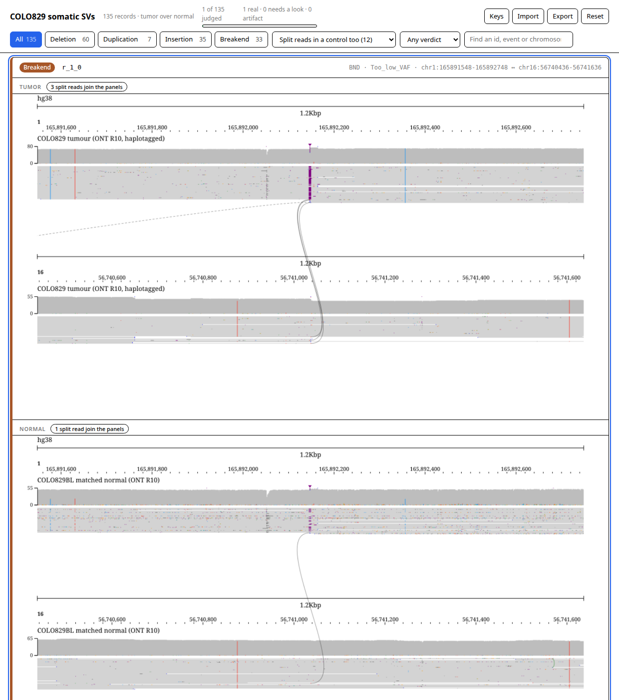
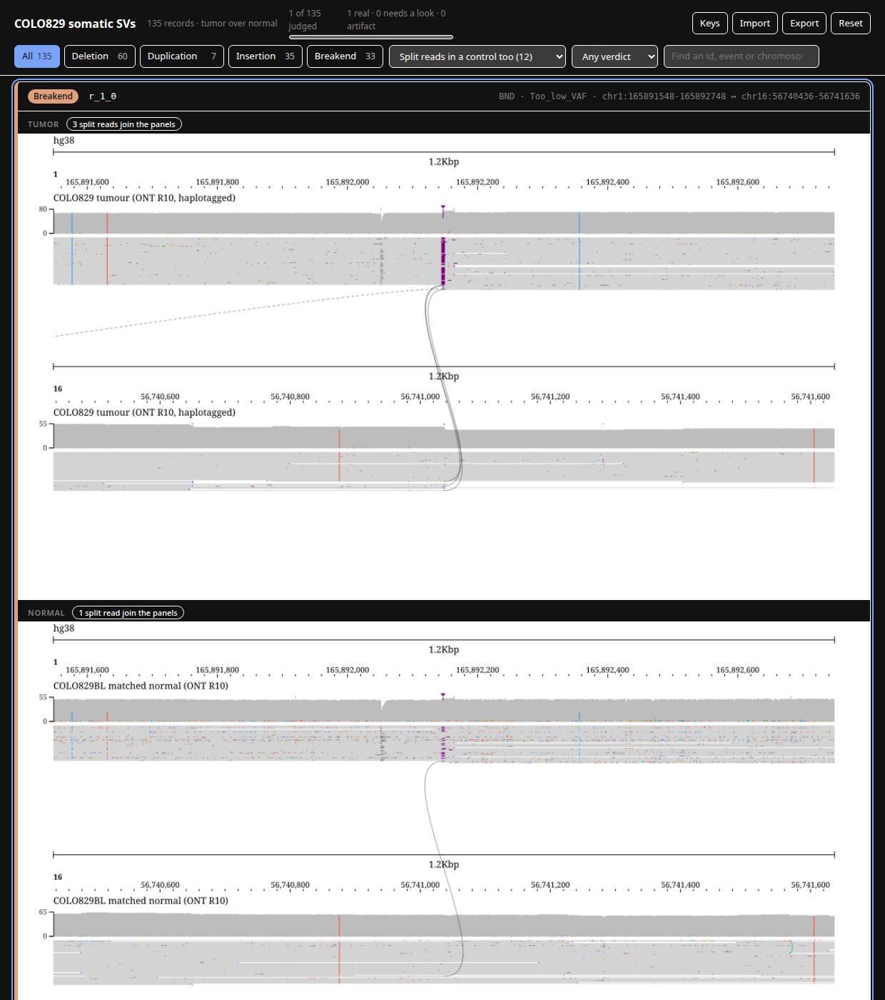

# variant-review-portal

Turn the images `jb2export batch` renders from a structural variant callset into
a **static review portal**: one card per record, the sample above its control, a
verdict, and a link that opens the same loci live in JBrowse.

A caller returns hundreds of structural variants and a VCF says nothing about
which are real. The reads do, and a picture of them per call is a queue a person
can finish.

```bash
# one directory of images per sample, from the same VCF
jb2export batch --vcf calls.vcf.gz --config config.json --assembly hg38 \
  --track tumor_reads --outDir tumor --manifest
jb2export batch --vcf calls.vcf.gz --config config.json --assembly hg38 \
  --track normal_reads --outDir normal --manifest

variant-review-portal --vcf calls.vcf.gz \
  --images tumor --images normal --out portal

npx serve portal
```



The page follows the reader's theme:



Both are the COLO829 somatic callset over the ONT open-data reads, 135 records
rendered in six minutes for the tumor and fifteen for the matched normal;
`docs/shoot.mjs` rebuilds them from a portal directory.

## Install

```bash
pnpm install
```

React, react-dom and esbuild build the page, and
[`@gmod/vcf`](https://www.npmjs.com/package/@gmod/vcf) reads the callset. The
images come from [`@jbrowse/img`](https://www.npmjs.com/package/@jbrowse/img),
which puts `jb2export` on your PATH; its manifest needs the `line` column, newer
than 5.0.0-beta.8.

## What a card holds

- **The first `--images` directory is the sample under review**, and its
  manifest rows are the cards. Every other directory joins to it on the record's
  line in the VCF, so a control rendered with a different `--limit` shows which
  cards it lacks.
- **The facts are the VCF's own columns**: `SVTYPE`, `SVLEN`, `FILTER`, `QUAL`,
  `EVENT`, `EVENTTYPE`.
- **A caller's `EVENT` is a filter**, and the chip on a card selects it. An
  event visiting more than two loci has a card of its own, every locus in one
  image. JBrowse reads the standard key;
  [Severus's `CLUSTERID` takes a rename](https://jbrowse.org/jb2/docs/user_guides/sv_inspector_view/#rearrangement-events).
- **Split reads, counted.** `jb2export` reports the split reads joining each
  image's panels, and every image says its number. The support filter sorts a
  callset three ways on it: no split read joins the panels, split reads in a
  control too, split reads in the sample only. A deletion short enough for one
  alignment to carry draws a gap and no connector, so it lands in the first
  group with its support in plain sight: the groups order the queue and the
  picture decides the card.
- **A link**, given `--jbrowse`, `--config`, `--assembly` and `--tracks`: a
  breakpoint split view over the card's loci, or a linear view over one.

## What comes out

```
portal/
  index.html      the review page: filters, verdicts, export
  img/<sample>/   a copy of each run's images
```

Nothing points outside the directory, so `aws s3 sync portal/ s3://…` is the
whole deployment.

## Reviewing

The queue takes the keyboard: <kbd>j</kbd> and <kbd>k</kbd> move,
<kbd>1</kbd> <kbd>2</kbd> <kbd>3</kbd> are real / needs a look / artifact on the
card under the cursor, <kbd>o</kbd> opens it in JBrowse and <kbd>/</kbd> jumps to
the search box. The same digit twice takes a verdict back off.

Set **Unreviewed** as the verdict filter and the queue drains as it is judged.

Verdicts live in the reviewer's browser. **Export** writes them as TSV beside
each record's line, id and coordinates, and **Import** reads that TSV back, so a
second reviewer or a cleared browser does not start the review again.

## Test

```bash
pnpm test
```

## License

Apache-2.0. The page is
[gene-review-portal](https://github.com/cmdcolin/gene-review-portal)'s, carried
over to variants.
