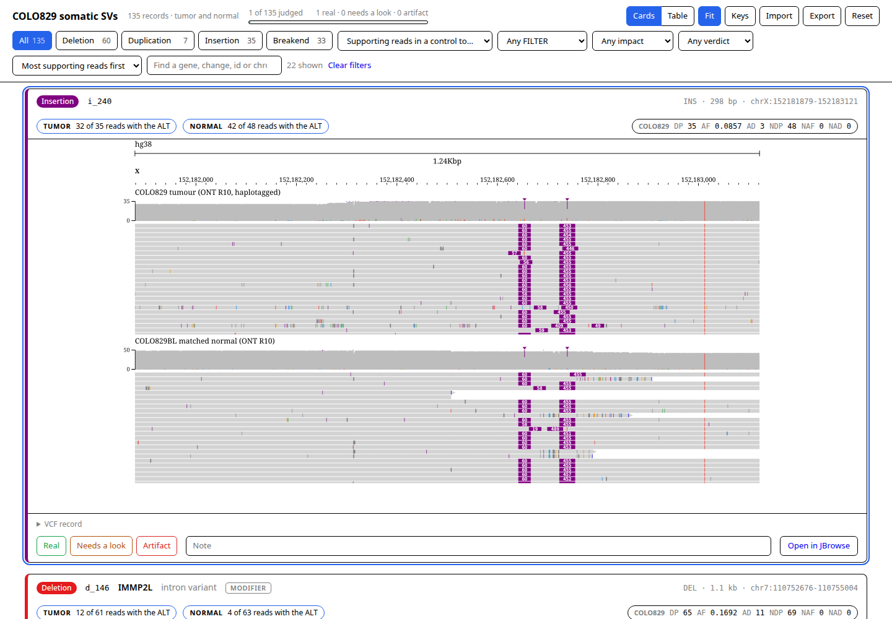
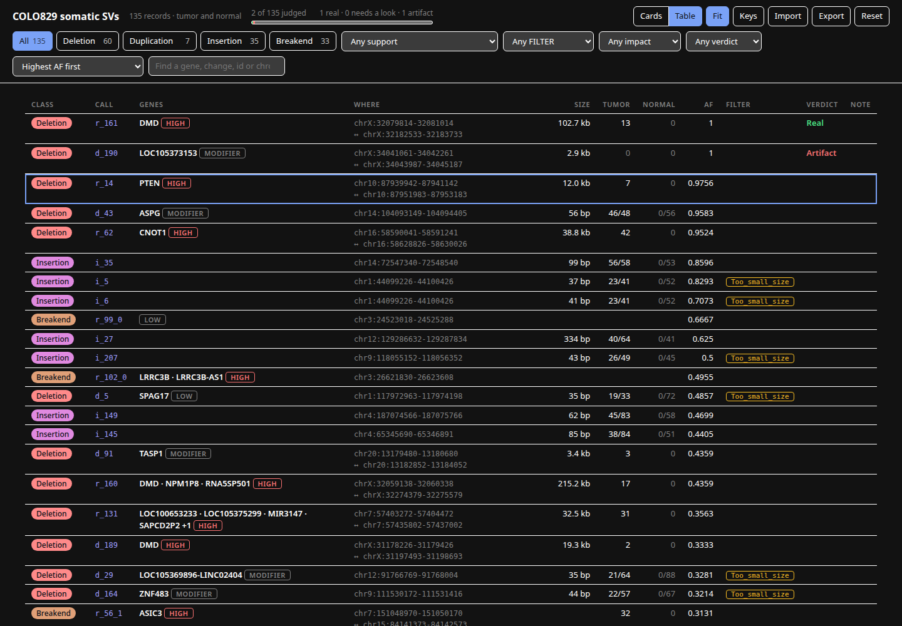
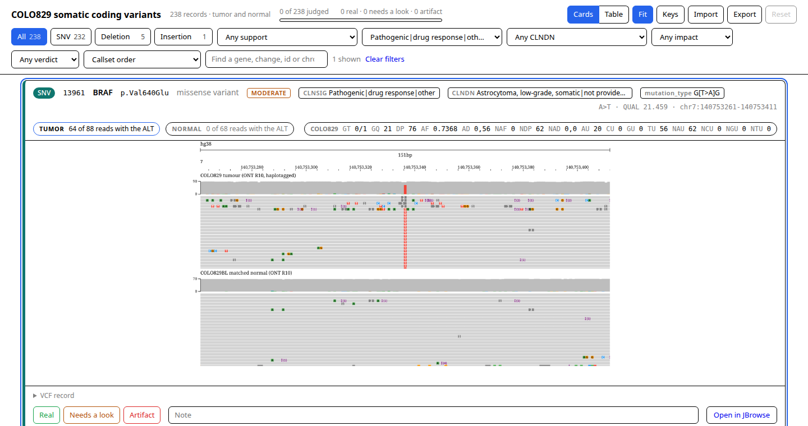

# variant-review-portal

Turn the images `jb2export batch` renders from a VCF into a **static review
portal**: one card per record, the sample and its control in one image, what the
VCF says about the call, a verdict, and a link that opens the same loci live in
JBrowse. Structural variants and small variants both: a breakend is two panels
joined by its split reads, an SNV is one panel sorted at its base.

A caller returns hundreds of variants and a VCF says nothing about which are
real. The reads do, and a picture of them per call is a queue a person can
finish.

```bash
# every alignments track in one run, so each record is one image; genes, the
# callset and repeats beside them say what a call hits and what it sits in
jb2export batch --vcf calls.vcf.gz --config config.json --assembly hg38 \
  --track genes height:50 --track calls height:50 \
  --track tumor_reads height:150 --track normal_reads height:150 \
  --track repeats height:50 --outDir reads --manifest

# name the tracks in the images, in track order: the sample, then its controls
variant-review-portal --vcf calls.vcf.gz \
  --images tumor,normal=reads --out portal

npx serve portal
```



The page follows the reader's theme, and the table lists the same queue a line a
card:



Both are the COLO829 somatic callset over the ONT open-data reads, 135 records
rendered from the public bucket in under five minutes; `docs/shoot.mjs` rebuilds
them from a portal directory.

A small-variant callset is the same page, one panel a card:



Three portals built this way are hosted:

- [COLO829 somatic SVs](https://jbrowse.org/demos/colo829_review/), 135 records
  of a melanoma line and its matched normal, Oxford Nanopore
- [HG008-T somatic SVs](https://jbrowse.org/demos/hg008_review/), the Cancer
  Genome in a Bottle draft benchmark, PacBio HiFi, whose `EVENT` clusters visit
  up to ten loci
- [COLO829 somatic coding variants](https://jbrowse.org/demos/colo829_snv_review/),
  238 SNVs and indels with a SnpEff or ClinVar annotation, _BRAF_ V600E among
  them

## Install

```bash
pnpm install
```

React, react-dom and esbuild build the page, and
[`@gmod/vcf`](https://www.npmjs.com/package/@gmod/vcf) reads the callset. The
images come from [`@jbrowse/img`](https://www.npmjs.com/package/@jbrowse/img),
which puts `jb2export` on your PATH; its manifest needs the `line` column, newer
than 5.0.0-beta.8. Small variants and the reads with a record's ALT need a
`jb2export` newer than 5.0.0-beta.13, and a live link one whose manifest has the
`spec` column.

## What a card holds

- **One image, every track.** `jb2export` draws a chromosome a row. Loci on
  one chromosome are a linear view: one window, or the two ends of a deletion,
  duplication or inversion side by side under the arc of the reads joining
  them. A junction between two chromosomes is a breakpoint split view, one
  panel a chromosome, and an event's loci on one chromosome share its row. Each
  has the sample's reads above its control's, split reads and reads carrying a
  large deletion on top. Any other track of the run is in the image too: genes,
  the callset itself, repeats. The image scales to the window so a whole card
  is on screen at once; click it, or press <kbd>f</kbd>, for full size.
- **Supporting reads, counted per track.** `jb2export` reports the split reads
  joining an image's windows, and, where a record's ALT says what a read
  carries (an SNV, an indel, a deletion or an insertion), the reads with the
  ALT over the reads covering it. A deletion of two windows has both, printed
  as `3 split + 4 gapped of 56 reads`: an aligner writes a deletion as a gap up
  to a size and as two pieces past it. An insertion of 50 bases or more is
  counted wherever in the image the aligner placed it.
  `--images tumor,normal=reads` names the tracks, and the support filter sorts a
  callset three ways: no supporting read, supporting reads in a control too,
  supporting reads in the sample only. One noisy base in one normal read files
  a call under the second, so the groups order the queue and the picture
  decides the card.
- **What the caller wrote.** The record's `SVTYPE`, size, `FILTER` and `QUAL`,
  its sample columns (`AF`, `AD`, `DP`, whatever the caller's `FORMAT` holds)
  and, under **VCF record**, every `INFO` key. Hover a key or a filter for the
  header's description of it.
- **Genes.** A VCF annotated by SnpEff (`ANN`) or VEP (`CSQ`) puts the genes,
  the effect and the protein change (`p.Val600Glu`) of its highest-impact
  annotation on the card, an impact filter in the header, and all three in
  search.
- **Facets.** `--facet CLNSIG,CLNDN` prints those `INFO` keys on every card and
  adds a filter for each to the header. `FILTER` is one already when a callset
  has more than one.
- **A caller's `EVENT` is a filter**, and the chip on a card selects it. An
  event visiting more than two loci has a card of its own, every locus in one
  image. JBrowse reads the standard key;
  [Severus's `CLUSTERID` takes a rename](https://jbrowse.org/jb2/docs/user_guides/sv_inspector_view/#rearrangement-events).
- **A link**, given `--jbrowse` and `--config`: the view the image was drawn
  in, which the manifest's `spec` column holds, with the tracks `--track` named.
  A track made from a file flag such as `--bam` is in no hosted config, so the
  link leaves it out. [Carrying the reads](#carrying-the-reads) puts them in
  the portal itself.

Images rendered apart still work: repeat `--images`, one directory per run, and
a card stacks them. The first directory's rows are the cards, and every other
joins on the record's line in the VCF, so a run with a different `--limit` shows
which cards it lacks.

## Carrying the reads

A link opens the reads wherever the config says they are. Where that is a server
a browser reaches slowly, or one that refuses a few hundred range requests,
`variant-review-slice` cuts the reads down to the cards' windows first and
writes a config that reads the slices:

```bash
variant-review-slice --vcf calls.vcf.gz --config config.json \
  --tracks tumor_reads,normal_reads --out portal

# render from the slices, which are local, then build into the same directory
jb2export batch --vcf calls.vcf.gz --config portal/config.json --assembly hg38 \
  --track tumor_reads --track normal_reads --outDir reads --manifest

variant-review-portal --vcf calls.vcf.gz --images tumor,normal=reads --out portal \
  --jbrowse https://jbrowse.org/code/jb2/latest/ \
  --config https://example.org/portal/config.json
```

`portal/reads/` holds one CRAM a track, or a BAM where the assembly is not a
FASTA `samtools` can read, and `portal/config.json` names them relative to
itself, so the directory still deploys whole. `--config` on the last command is
where that file will be served. It needs `samtools` on the PATH, and a
`jb2export` that reads a config's relative files from beside it, newer than
5.0.0-beta.13.

The slices hold whole reads, so their size follows the read length more than the
window: the HG008-T portal's 181 cards are 115 MB of PacBio HiFi, tumor and
normal, beside 17 MB of images. A CRAM is written in slices of 250,000 bases,
a twentieth of `samtools`' default, because a reader decodes a whole slice to
draw one window of it. Rendering from them took about three minutes, several
times quicker than from the full files over the network. A link over slices shows reads at
the cards' windows and nowhere else.
[`examples/hg008/config.json`](examples/hg008/config.json) is the config that
portal was sliced from.

## What comes out

```
portal/
  index.html      the review page: filters, verdicts, export
  img/<tracks>/   a copy of each run's images
  config.json     with variant-review-slice: the config its links open
  reads/          with variant-review-slice: the sliced reads
```

Nothing points outside the directory, so `aws s3 sync portal/ s3://…` is the
whole deployment.

## Reviewing

The queue takes the keyboard: <kbd>j</kbd> and <kbd>k</kbd> move,
<kbd>1</kbd> <kbd>2</kbd> <kbd>3</kbd> are real / needs a look / artifact on the
card under the cursor, <kbd>n</kbd> writes a note on it, <kbd>o</kbd> opens it
in JBrowse and <kbd>/</kbd> jumps to the search box. The same digit twice takes
a verdict back off.

<kbd>t</kbd> swaps the cards for the table, where the same keys judge a row and
<kbd>Enter</kbd> opens its card. The order select sorts either by size, by split
reads, by the reads a control has, or by any number in the caller's sample
column.

Set **Unreviewed** as the verdict filter and the queue drains as it is judged.

The address bar follows the filters, the order and the card under the cursor, so
copying it is a link to that card in that queue.

Verdicts and notes live in the reviewer's browser. **Export** writes them as TSV
beside each record's line, id, coordinates, genes and supporting-read counts, and
**Import** reads that TSV back, so a second reviewer or a cleared browser does
not start the review again.

## Test

```bash
pnpm test           # the card and review logic, no browser
pnpm test:browser   # a built portal driven in Chrome
```

## License

Apache-2.0. The page is
[gene-review-portal](https://github.com/cmdcolin/gene-review-portal)'s, carried
over to variants.
